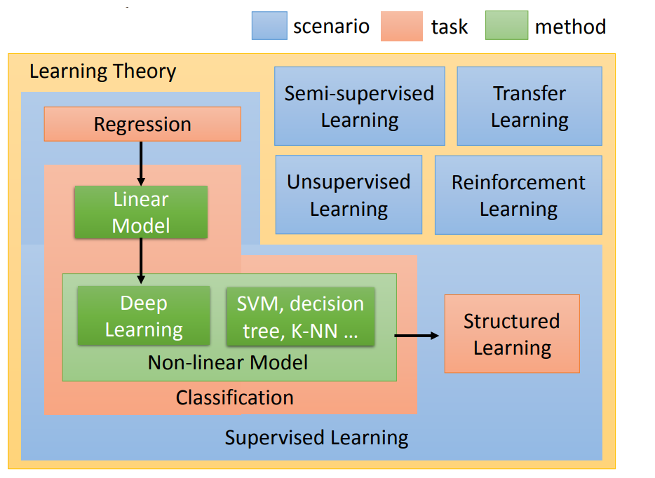

# 机器学习介绍

## 机器学习相关的技术

### 主要技术方向分类

主要分为这几类：

   * 监督学习
   * 半监督学习

* 迁移学习

* 无监督学习

* 监督学习中的结构化学习

* 强化学习

  ​         因为职业特殊性，我比较关注 无监督学习，比如聚类，复杂网络中的社区发现，关联规则中的购物篮分析，这些分析类别都不属于机器学习中的主流的预测中的任何一类，火的一塌糊涂的 *图神经网络* 是神经网络与复杂网络 结合的的一个东西。

  ​		神经网络与图的结合，也是神经网络往非结构化的数据表达领域发展而来的一个方向，我们现实生活中还有多少非结构化的方向可以与之结合呢？ 神经网络遇到了大数据，硬件助推下的算力提升，才迎来了新鲜的生命力，下一个十年什么最火呢？

  ​		放一下图镇楼：

  

### 机器学习不断地渗透到更智能的抽象领域

​		 程序员这个职业越来越模糊了，将来以后就像信息化深入到各行各业中一样，任何人都可以用信息化来快速解决问题。

​			*机器学习与数据挖掘的问题得界限是什么?*

​			将来会不会某一天或许机器学习会代替人类做数据挖掘，我们成为机器的附庸，我们不停地为机器劳动，投喂电力和数据标签，机器计划着我们得了什么病，怎么诊断和治疗，应该生多少孩子，老了应该死去？

## 机器学习目的

​	解决问题，无论任何公司，需要的是解决问题的人，不应拘泥于形式。

​	因为我们没有data做监督学习 ==> 所以我们才做reinforcement learning ，而不是reinforcement learning 火，我才硬凑上去部署reinforcement learning ，我们要学习，但是更要学以致用。

## 我的计划

* 动手写 线性回归 模型

* 动手写 逻辑回归 模型

* 动手写 一层神经网络

* 动手写两层以上的神经网络

